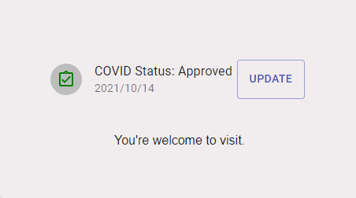
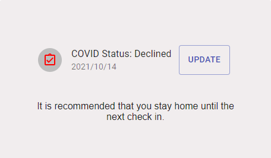

## Table of contents

* [Team Members](#team-members)
* [Overview](#overview)
* [User Guide](#user-guide)

### Team Members
* Jake Imanaka
* Clyde James Felix
* Patrick McCrindle
* Tsz Wong
* Justin Wong

## Overview

Covid Trail is a web application for UH students, faculty, and staff to check in on their symptoms for Covid-19.

It is designed after the LumiSight UH application:

* Users can sign up or login.
* Users can check in regarding their symptoms, and update it accordingly.
* Users will eventually be able to upload their vaccination cards

Our deployed website can be found on:

Our development can be found on: [Github](https://github.com/CovidTrail/covidtrail)

## User Guide

Our user guide will help you walkthrough Covid Trail's user interface and how to do your daily check ins.

### Landing Page

When users visit our site, they are presented with what our application does and how to sign up.

### Sign Up and Login Page

Clicking on the REGISTER HERE button on the landing page or clicking the top right icon and choosing register leads you to the register page.

Clicking on the SIGN IN button on the landing page or clicking the top right icon and choosing Login leads you to the Login page.

### Landing Page after Logging In

After logging in, users are taken back to the landing page, except the SIGN IN and REGISTER button is replaced with the user's covid status.

### Check in Page

The checkin page displays a list of questions and symptoms for users to check. 

Users can update their covid status and see whether they can visit or stay home.

### Profile Page

Users can access their profile by clicking the top right icon in the header.
There, they can see and update their name and email.

