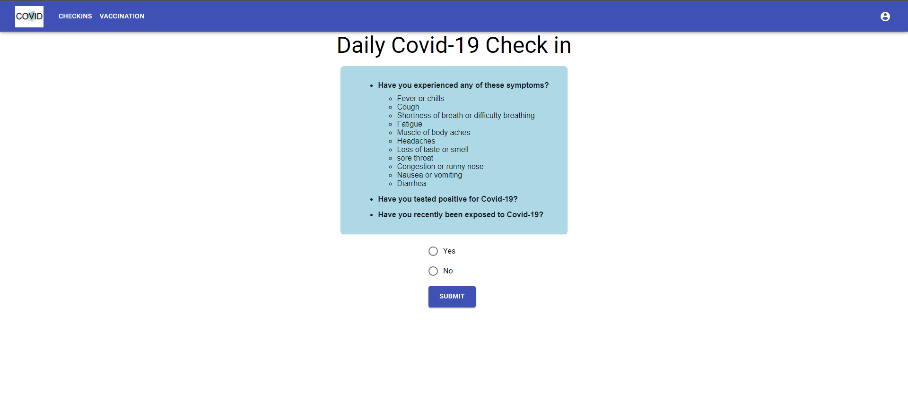
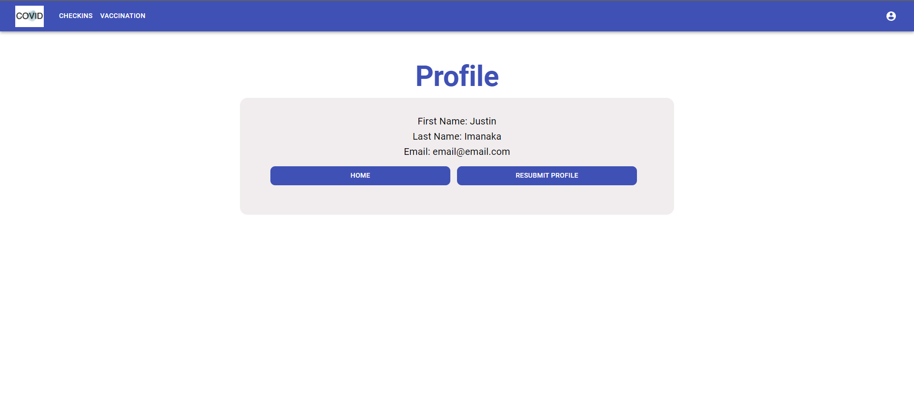
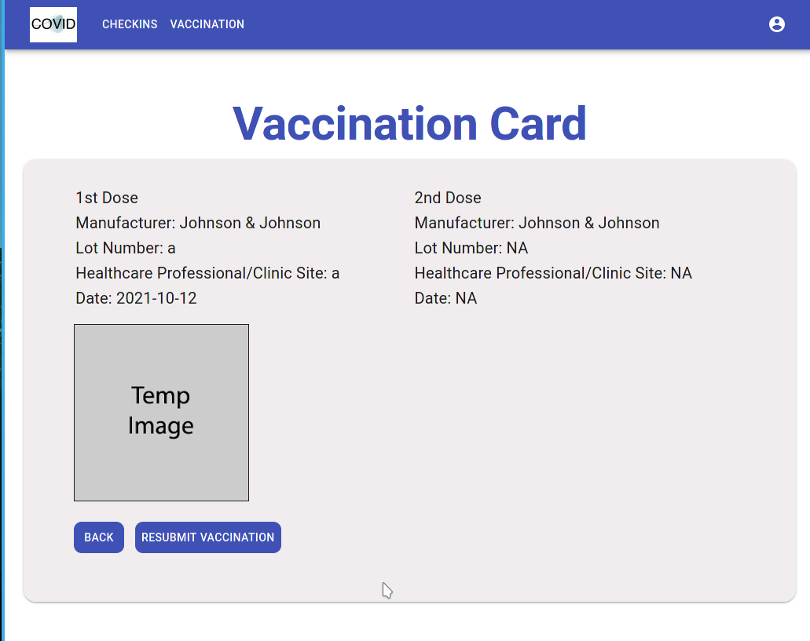

## CovidTrail

### Table of contents

* [Team Members](#team-members)
* [Overview](#overview)
* [User Guide](#user-guide)

### Team Members
* Jake Imanaka
* Clyde James Felix
* Patrick McCrindle
* Tsz Wong
* Justin Wong

## Overview

Covid Trail is a web application for UH students, faculty, and staff to check in on their symptoms for COVID-19.

It is designed after the LumiSight UH application:

* Users can sign up or login.
* Users can check in regarding their symptoms, and update it accordingly.
* Users can upload their vaccination cards and vaccine card information

Our deployed website can be found on: [CovidTrail](https://covidtrail.meteorapp.com)

Our development can be found on: [Github](https://github.com/CovidTrail/covidtrail)

## User Guide

Our user guide will help you walkthrough Covid Trail's user interface and how to do your daily check ins.

### Landing Page

When users visit our site, they are presented with what our application does and how to sign up.

### Sign Up and Login Page

Clicking on the REGISTER HERE button on the landing page or clicking the top right icon and choosing register leads you to the register page.

Clicking on the SIGN IN button on the landing page or clicking the top right icon and choosing Login leads you to the Login page.

### Landing Page after Logging In

After logging in, users are taken back to the landing page, except the SIGN IN and REGISTER button is replaced with the user's COVID-19 status.

### Check in Page

The checkin page displays a list of questions and symptoms for users to check.

Users can update their COVID-19 status and see whether they can visit or stay home.

### Profile Page

Users can access their profile by clicking the top right icon in the header.
Users who haven't created their profile yet will be taken to this beforehand.

Users can update their name and email.

### Submit Vaccination Information

This page allows users to submit all pertinent information about their current vaccination status. Begin by selecting the type of the vaccine that you have received. If you only have one shot type then you are only shown the fields for one-shots worth of information.

Additionally, if you only have a one shot variant you will only be shown the first shot information fields.

### Vaccination Card

This page will display all information from the vaccination submission page. If you have not entered vaccination information you instead will be shown a button that will take you to the Submit Vaccination page. If you have only received one shot or only have a one shot variant then the second shot information will display N/A.

